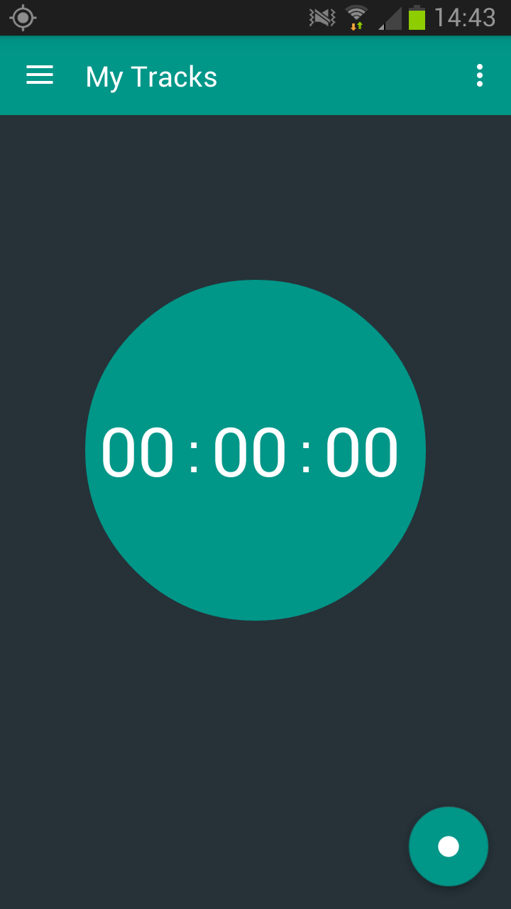

# Standing Still
## Problem Description
This Checkpoint Requires That an android apllication is designed, developed and deployed. The Application is a Productivity application that records a users activity in a particular location. By default it records where a user stands for more than 5 minutes but a user can customize the time delay. The Application makes use of The User's GPS to determine location and Internet connectivity to request for updates.

## Approach
The Tracker app is divided into the following features

## Start/Stop Screen
This feature enables a user to be able to start tracking his/her activity. The user presses the start button and the tracking will be initialized and the button icon changes to indicate that tracking is going on. The `GoogleLocationService` will be initialized and make connections to `GoogleApiClient` 

## Customize Time
This feature allows a user to be able to set the minimum time required for a location and activity to be recorded. The user can access this feature by pressing the options menu at the top right of the toolbar then select the Setings option.

## Record Location
This feature saves the user activity and location provided the the time spent is equall or greater than the delay time set by the user.
The `GoogleApiClient` calls the `onLocationChanged` callback which in turn returns the user location at certain intervals.
`getAddress` calls a listener that uses `GeoCoder` to get the current address of the user.
The `ActivityBroadCastReceiver` Requests for update of the user activity and the `IntentService` returns it in the background.
The App Recieves the updates and checks if the user activity has changed. `hasChanged` compares the newly recived update with previous one to determine a change in activity. `shouldSave` checks if the `timeSpent` of the previous activity meets the minimum required time set by the user.
The `save` method initializes the DB and calls the `getMovement` which sets all the properties of the user movement and saves it in an SQLite DB Whose contracts, method and helper are defined in the `com.andela.standinstill.dal` package

## Movement Defined
The `Movement` class defines an `enum` of activity types.
The `isSignificant` method returns true only if the activiy `Type` is significant i.e. walking, in transport, running or on a bycycle.
Only significant movements are saved

## Listing Locations
This feature lists all the user's location by day. It can be accessed from the navigation drawer by clicking timeline. This menu calls `DisplayRecordActivity` and it makes of a frgment defined in the `com.andela.standinstill.fragment` package. the view makes of recycler view whoses adapter is defined in `com.andela.standinstill.adapter` package. The fragment implements `DateTimePickerDialogFragment` defined in `com.andela.standinstill.fragment` the user can select the date he/she wish to view from the calendar icon on the toolbar. 

## Group Similar Locations
This feature groups similar locations together and the total time spent in that location and can be accessed from the navigation bar by clicking locations.

##Screenshots

## Requirement
The app reqiures the following
* API level 15+
* Internet connectivity
* Updated Google play services
* GPS

